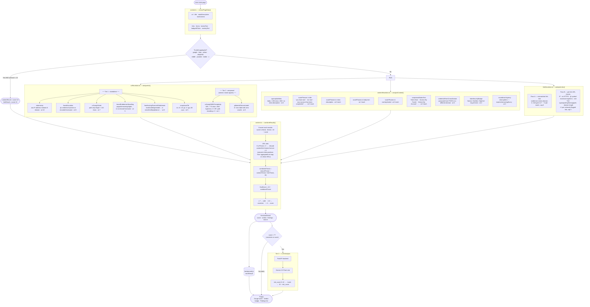

# Beacon — Heuristics System

---

## Score scale

| Score | Verdict | Meaning |
|---|---|---|
| 7 – 10 | **Safe** | No significant indicators |
| 4 – 6 | **Uncertain** | Multiple signals — verify independently |
| 0 – 3 | **Scam** | Strong phishing indicators — avoid |

## URL rule weights reference

| Rule | Tier | Weight | Fires when |
|---|---|---|---|
| `isdomainip` | 1 | 10 | Hostname is a raw IPv4 address |
| `hasobfuscation` | 1 | 8 | `@` credential injection or encoded hostname |
| `urlLengthHard` | 1 | 7 | Path (no query string) > 144 chars |
| `brandSubdomainSpoofing` | 1 | 5 | Known brand in non-brand hostname |
| `freeHostingFinancialSubdomain` | 1 | 5 | Financial keyword in Vercel/Netlify/etc. subdomain |
| `suspiciousTld` | 1 | 5 | `.icu` `.tk` `.ml` `.ga` `.cf` `.gq` `.cfd` `.cyou` |
| `urlLengthWithComplexity` | 2 | 4 | URL > 75 chars AND (hyphens ≥ 3 OR path encoding ≥ 3) |
| `gibberishDomainLabel` | 2 | 3 | 4+ char label with zero vowels |

## Content rule weights reference

| Rule | Weight | Fires when |
|---|---|---|
| `sparsityNoMeta` | 3 | Body < 200 chars AND no meta description |
| Scam phrase — title/meta | 3 each | Phrase from list appears in title or meta |
| Scam phrase — body/overlay | 2–3 each | Phrase appears in body text or open modal |
| `suspiciousButtonText` | 3 each | CTA button contains urgency/harvest phrase |
| `credentialFormCrossDomain` | 6 | Password form POSTs to different domain |
| `fakeSecurityBadge` | 2 | Norton/McAfee/DigiCert/etc. in img alt |
| `countdownUrgency` | 2 | Clock pattern + urgency word in body |
